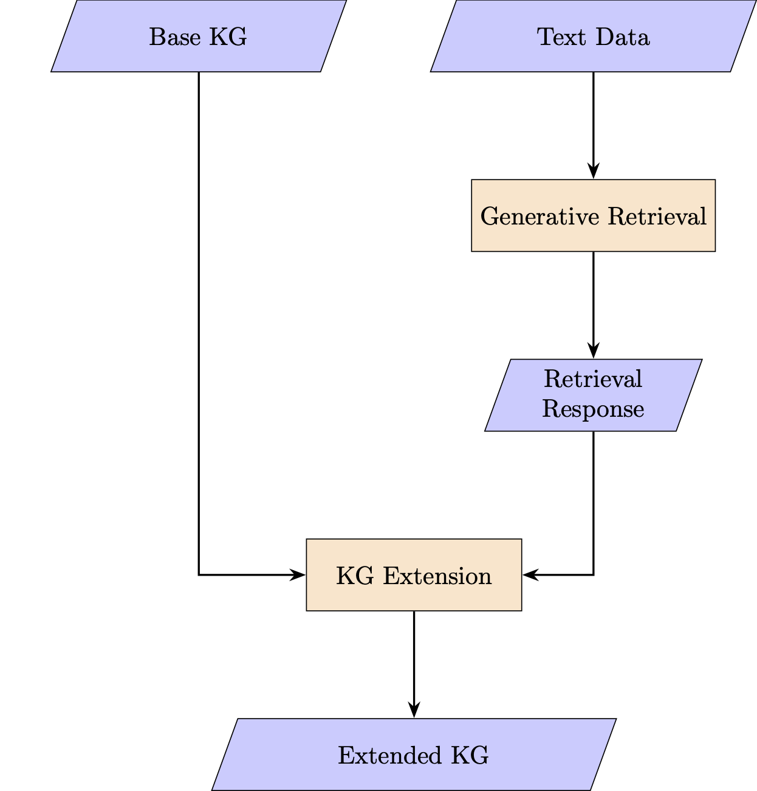

# GR-KG
Project for the University of Bologna "Cognitive Semantics for Artificial Intelligence" course (a.y. 2024-25).

## Project Description

### Knowledge Graph Extension
The basic idea is to extend a given knowledge graph (KG) using a Large Language Model (LLM). The LLM is used to add information to the existing graph.

### Generative Retrieval
This method uses a LLM to perform a retrieval-like task. The LLM scans a large body of text (e.g. a book, a transcription, a database, etc.) and generates condensed, abstractive representations of the information most relevant to a query. This approach can be seen as a hybrid between information retrieval and abstractive summarization.

### Knowledge Graph Extension based on Generative Retrieval
Instead of relying on the implicit knowledge baked into the LLM, through GR a large body of text data can be used as a knowledge base for the KG extension. This method has a few different advantages: it reduces the possibility of hallucination, it allows to deal with up-to-date information, it allows to deal with specific or niche bodies of knowledge and, most importantly, provides direct grounding to knowledge.

### Procedure 
Provide the LLM with data and prompt it to extract the relevant information and give a response in natural language. The extracted information is then used as the content of the knowledge graph extension, that will be performed by another instance of the LLM.
Notice that I use two distinct instances of the LLM instead of one. This has a few advantages:
- Lighter use of the context window in each instance, permitting to use more data and longer
prompts in both instances.
- More control over the prompts, leading to better testability and more control over the results.
- The possibility to use two different specialized models, since the two tasks are quite different.

## Examples
As use cases, I show extensions of a [KG](base_graph.ttl) that represents basic information about a movie from [IMDb](https://www.imdb.com).

### [Extension 1](extension_1) 
The information for the extension is extracted from a collection of [Reddit](https://www.reddit.com) posts and comments and consists of a summary of immediate viewer reactions. 

### [Extension 2](extension_2)
The information for the extension consists of the semantic frames of emotional situations portrayed in the movie, extracted from the movie transcript.

### [Extension 3](extension_3)
The information for the extension is a summary of the movie plot, extracted from the Wikipedia article [Lilo & Stitch (2025 film)](https://en.wikipedia.org/wiki/Lilo_%26_Stitch_(2025_film)).

### [Extension 4](extension_4)
This example shows a double iteration of the procedure. The [extended KG](extension_3/extended_graph_3.ttl) from Extension 3 is now used as an input and further extended with the [information](extension_1/GR_response_1.txt) from Extension 1, resulting in a [new extended KG](extension_4/extended_graph_4.ttl). 

## Further Information and References
For further information and references, check the pdf [document](GR_KG.pdf).

